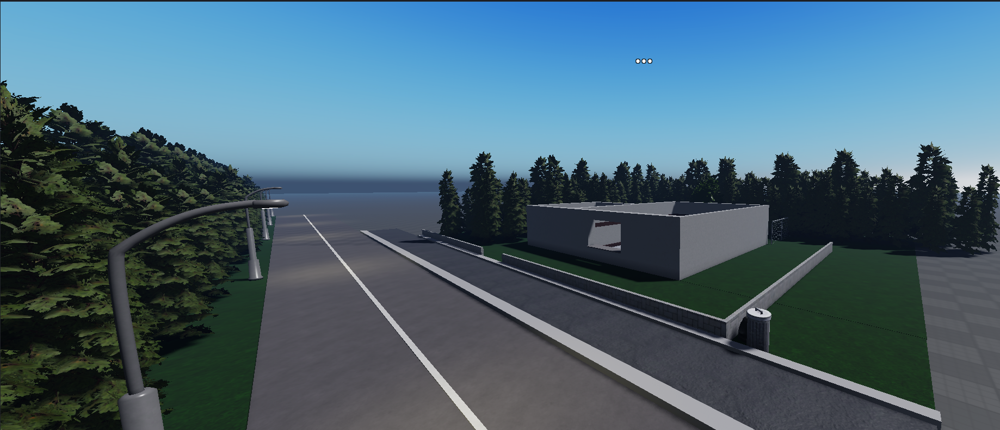
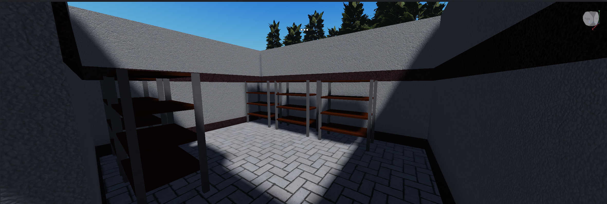
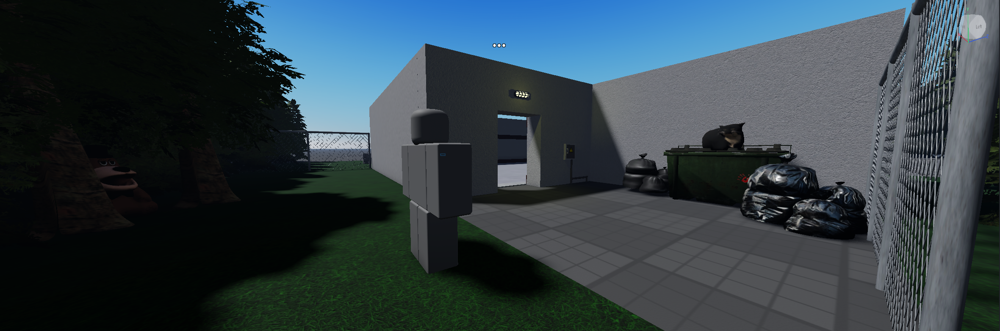

# TFC-Horror

A cooperative horror game for Roblox where players work together in a drive-thru restaurant, preparing orders, monitoring surveillance cameras, and identifying dangerous anomalies before it's too late.

This project is built with **Roblox Studio + Rojo** and follows a staged roadmap from MVP to full release.

---

## Table of Contents
- [TFC-Horror](#tfc-horror)
  - [Table of Contents](#table-of-contents)
  - [Project Status](#project-status)
  - [Core Gameplay Concept](#core-gameplay-concept)
  - [MVP Scope (Prototype)](#mvp-scope-prototype)
  - [Development Roadmap Overview](#development-roadmap-overview)
  - [Tech Stack](#tech-stack)
  - [Project Structure](#project-structure)
  - [Getting Started](#getting-started)
    - [Requirements](#requirements)
    - [Build the Place](#build-the-place)
  - [License](#license)
  - [Demonstration](#demonstration)
    - [Gameplay Examples](#gameplay-examples)
    - [Restaurant Layout](#restaurant-layout)
    - [Disclaimer](#disclaimer)

## Project Status

🚧 **PAUSED**  
Current focus: **MVP → v0.x core gameplay systems**

See the full development plan here:  
📍 **[Project Roadmap](./ROADMAP.md)**

---

## Core Gameplay Concept

- 1–4 player cooperative horror experience
- Drive-thru restaurant setting
- Physical food preparation mechanics
- NPC customers with anomalous behavior
- Surveillance cameras with night vision
- Mistake-based escalation leading to catastrophic events

Players must:
- Prepare and deliver correct orders
- Monitor NPC behavior via cameras
- Detect anomalies
- Decide when to close service counters
- Survive the shift

---

## MVP Scope (Prototype)

The MVP focuses on delivering a **single complete playable round** with:

- Local or private lobby (1–4 players)
- One restaurant map
- Basic cooking flow (ingredients → fryer → pickup)
- NPC order system
- Initial anomaly mechanics
- Round timer and end-of-round results
- Surveillance camera system
- Core UI (orders, timer, stock, mistakes)

Detailed breakdown:  
➡️ **[MVP & Version Breakdown](./ROADMAP.md#mvp-core--mandatory-for-prototype)**

---

## Development Roadmap Overview

High-level version milestones:

- **v0.1** — Core round loop
- **v0.2** — Physical ingredients & stock system
- **v0.3** — NPC behavior, queues, base anomalies
- **v0.4** — Counter closing & camera systems
- **v0.5** — Multiplayer & synchronization
- **v0.6–0.8** — Content expansion, polish, atmosphere
- **v0.9** — Pre-release & analytics
- **v1.0** — Public release

Full details available in:  
📄 **[ROADMAP.md](./ROADMAP.md)**

---

## Tech Stack

- **Engine:** Roblox Studio
- **Language:** Luau
- **Architecture:** Server-authoritative
- **Core Systems:**
  - `RoundManager`
  - `NPCManager`
  - `InventoryManager`
  - `AnomalyManager`
- **Networking:** RemoteEvents / RemoteFunctions
- **UI:** Roblox UI + ViewportFrame
- **Build Tool:** Rojo

---

## Project Structure

This repository is generated and managed using **Rojo**.

```
TFC-Horror/
├── src/
│   ├── Server/
│   ├── Client/
│   ├── Shared/
│   └── Modules/
├── default.project.json
├── ROADMAP.md
├── LICENSE
└── README.md
```

## Getting Started

### Requirements
- Roblox Studio
- Rojo (v7.7.0 or compatible)
- Roblox account

### Build the Place
To build the place from scratch:
```bash
rojo build -o "TFC-Horror.rbxlx"
```

Open TFC-Horror.rbxlx in Roblox Studio, then start the Rojo server:
```bash
rojo serve
```

For more details, see the official documentation:
📘 [Rojo Documentation](https://rojo.space/docs/v7/)

Contributing

This project is under active development.
Contributions, ideas, and discussions are welcome.

Recommended areas:

Gameplay systems

NPC behavior logic

Anomaly design

Performance optimization

UI/UX improvements

## License

This project is proprietary software.

All rights are reserved.  
Unauthorized copying, modification, distribution, or use of this software
is strictly prohibited.

See the full license text here:  
📄 [LICENSE](./LICENSE)


## Demonstration

<div align="center">

### Gameplay Examples

**Items & Cooking System**  
  
_Item interaction_

**NPC Customers**  
  
_Simple customer behavior and queues_

### Restaurant Layout  
  
  
  

</div>

### Disclaimer

This is a horror project.
Visual, audio, and gameplay elements may include intense or disturbing content.
